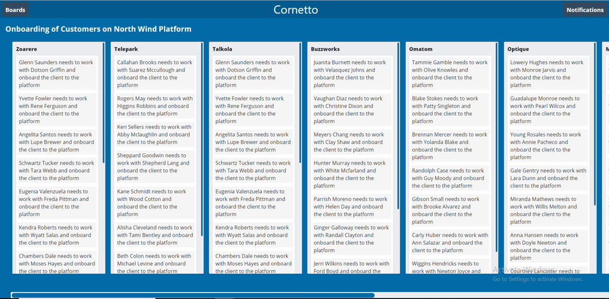

## Kriya Powered By TypeScript

### Context

The team of Kriya App have developed a Task Board Render, which can display the data in the desired format using JavaScript. Organization has planned to extend the functionality of Kriya App by adding new features. This requires more developers to be added to the team to scale the project. ​

The app is created using JavaScript which is a dynamically typed language, the types are checked, and datatypes errors are only spotted at runtime. Dynamic type checking results in less optimized code than static type checking.​

To create a code that is less prone to errors,to scale the project and to move faster into the market, Kriya app source code needs to be changed from JavaScript to TypeScript since TypeScript is strictly typed.

### Practice Exercise
 
Convert the Kriya app created in JavaScript to TypeScript. ​​Add a decorator to the created class to profile the app performance using the instructions given below. Task Board Render should still display the data in the following format:

### Follow these instructions to complete the exercise:

- Install Typescript on your system using NPM
- Use appropriate data types for all the data used in the solution​
- Avoid using **any** type unless you are not sure about the data type
- Create model class for the Board,List and Card
- Use these model class for method parameters and return parameters 
- Encapsulate the **transform** method into a class.
- Decorate the **transform** method with the newly created decorator​
- Indent the Typescript code appropriately​
- Include comments, wherever required, to make the code readable
